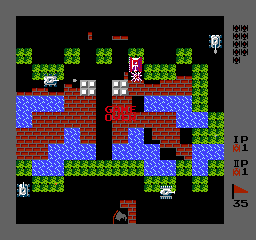

# NESRecomp

Static recompilation of NES games to native C code. No interpreter hot loop — every 6502 instruction becomes a C function that yields back to the main loop after each control-flow instruction (JMP, JSR, RTS, RTI, BRK, branches). The interpreter remains only as a fallback for addresses that can't be statically discovered (e.g., indirect JMP targets).

## How it works

1. **Discoverer** (`tools/nesrecomp.py`) — BFS from RESET/NMI/IRQ vectors, follows JSR/JMP abs/branches, groups sequential instructions into functions, emits C code
2. **Emitter** — each function becomes a `void func_XXXX(void)` that sets `cpu.PC`, adds `g_cpu_cycles`, executes the instruction, and `return`s on any control-flow instruction
3. **Dispatch table** — `call_by_address(addr)` switch over all discovered function entries; the default case runs one instruction via the interpreter
4. **Main loop** (`runner.c`) — dispatches one instruction per iteration, then steps PPU (×3) and APU for the accumulated cycles before dispatching the next instruction
5. **ROM data** is embedded at compile time by `tools/extract_rom_data.py` (ROM → C header/source) — no external ROM file needed at runtime

## Features

- **No interpreter hot loop** — every instruction yields to the main loop; PPU/APU stay in sync
- **No runtime ROM dependency** — PRG/CHR data compiled into the binary
- **Yield-based control flow** — JMP, JSR, RTS, RTI, BRK, and all branches set `cpu.PC` and `return`
- **Learning mode** — `RECOMP_LEARN=1` collects dispatch misses into a `.cfg` file for the next recompilation
- **FCEUX-faithful verification** — an optional headless interpreter build (`INTERP=1`, `--interp=fceux`) reproduces FCEUX's per-frame timing for automated regression testing against TAS movies (see *Accuracy Verification*)
- **Universal Makefile** — same Makefile works on Linux and Windows (MinGW), with cross-compile support
- **Per-game binary** — `GAME=BattleCity` → `bin/BattleCity`
- **Mapper support** — NROM, MMC1, UNROM, CNROM, MMC3, MMC5
- **Save states** — F5 save, F8 load (persisted to `<bin-dir>/sav/GAME.state`)
- **Battery-backed SRAM** — auto-loaded/saved to `<bin-dir>/sav/GAME_battery.sav` when cartridge has battery flag
- **Screenshot** — F12 (saves `screenshot_<ticks>.png`); `--screenshot FILE.png` at launch for headless capture
- **Fullscreen** — F11 toggle
- **Widescreen** — Tab toggle
- **Scale** — `--scale N` at launch; compile-time default via `make DEFAULT_SCALE=3`

## Quick Start

### Linux

```bash
# Install dependencies
sudo apt install build-essential libsdl2-dev python3 make git

# Clone and build
git clone <url> nesrecomp
cd nesrecomp

# Place your ROM in rom/MyGame.nes, then:
make GAME=MyGame
./bin/MyGame
```

`ROM` defaults to `rom/$(GAME).nes`. If your ROM is elsewhere, pass it explicitly:

```bash
make GAME=MyGame ROM=/path/to/game.nes
```

If `asm/MyGame.asm` exists it is picked up automatically. The config `cfg/MyGame.cfg` is always used if present.

The `.asm` file is a **ca65 assembly source** (e.g. from a manual disassembly session in Ghidra, IDA, or da65). `tools/nesrecomp.py` extracts every labeled address ≥ `$8000` and adds them as extra BFS seeds — useful for entry points that static analysis can't reach on its own, such as indirect jump targets and data-driven dispatch tables.

You can also pass it explicitly:

```bash
make GAME=MyGame ASM=MyGame.asm
```

When `ASM` is set, the build pipeline runs `asm_parser.py` as a dedicated step before `nesrecomp.py`. Discovered labels are merged as `extra_func` entries directly into `cfg/MyGame.cfg` (existing entries and other directives are preserved).

### Windows (MinGW)

```bash
# Install MSYS2 with mingw-w64-x86_64-gcc, SDL2, make, python
pacman -S mingw-w64-x86_64-gcc mingw-w64-x86_64-SDL2 make python

make GAME=MyGame
./bin/MyGame.exe
```

### Cross-compile from Linux to Windows

```bash
sudo apt install gcc-mingw-w64-i686
make CROSS=1 GAME=MyGame
# produces bin/MyGame.exe (Windows PE)
```

## Learning Mode

The static discoverer can't follow indirect jumps (`JMP ($XXXX)`). To find the missing addresses:

```bash
RECOMP_LEARN=1 GAME=MyGame ./bin/MyGame
# Play through the game, then exit with ESC.
# Dispatch misses are saved automatically to cfg/MyGame.cfg
```

Then recompile — the config is picked up automatically:

```bash
make GAME=MyGame
```

Run repeatedly — each session builds on the previous `cfg/MyGame.cfg`. Eventually all reachable code is in the dispatch table.

### Headless Mode

Run without video or audio. The game emulates at full speed, collecting dispatch misses:

```bash
RECOMP_LEARN=1 GAME=MyGame ./bin/MyGame --headless --seconds 30
```

`RECOMP_LEARN=1` is set automatically in headless mode.

### TAS Playback

Replay an FM2 (FCEUX movie) file to exercise code paths from a full playthrough:

```bash
RECOMP_LEARN=1 GAME=MyGame ./bin/MyGame --playback fm2/MyGame.fm2
```

Combine with `--headless` for fully automated discovery:

```bash
GAME=MyGame ./bin/MyGame --headless --playback fm2/MyGame.fm2
```

On each frame (`NMI`) the controller state is loaded from the next FM2 line. The keyboard is ignored during playback. The program exits when all frames are consumed.

## Accuracy Verification

An interpreter-only build (`make GAME=MyGame INTERP=1`) ships three headless backends used to verify timing against a real emulator, frame by frame:

- `--interp` / `--interp=beam` — beam-accurate interpreter (per-dot PPU)
- `--interp=fceux` — FCEUX-faithful playback; matches FCEUX's per-frame lag/timing model and is the reference backend for regression testing
- `--interp=fceux_vendor` — the same loop driven by a vendored FCEUX CPU core, a cycle-exact differential oracle (see the GPL note below)

`--dump-sync FILE` writes a per-frame `frame  lag  lagcount  ram-hash` log at each VBL boundary. `tools/verify_all.sh` replays every FM2 in `fm2/` through the backends and diffs the per-frame lag flag against FCEUX reference dumps in `lags/`. Across the whole test corpus the `--interp=fceux` backend reproduces FCEUX's lag timing exactly (100% frame-for-frame, zero drift).

### GPL vendor oracle (optional)

`--interp=fceux_vendor` is built from vendored FCEUX sources, which are GPL. To keep this repository GPL-free, those four files live in a **gitignored `nogpl/`** directory rather than in `src/`. The Makefile auto-detects `nogpl/` and, when present, compiles the oracle into the `INTERP=1` build (`-DHAVE_VENDOR`). Without `nogpl/`, the default build is GPL-free and `--interp=fceux_vendor` is disabled with a message; the non-GPL `--interp=fceux` backend is unaffected.

## Controls

### Gamepad (Player 1)

| NES button | Key         |
|------------|-------------|
| A          | Z           |
| B          | X           |
| Select     | Right Shift |
| Start      | Enter       |
| Up         | Arrow Up    |
| Down       | Arrow Down  |
| Left       | Arrow Left  |
| Right      | Arrow Right |

### Hotkeys

| Key | Action                                      |
|-----|---------------------------------------------|
| ESC | Quit                                        |
| F5  | Save state (`sav/GAME.state`)               |
| F8  | Load state                                  |
| F11 | Toggle fullscreen                           |
| F12 | Screenshot (`screenshot_<ticks>.png`)       |
| Tab | Toggle widescreen (pillarbox → stretch)     |

## Project Structure

```
src/
  runner.c / include/runner.h   — SDL loop, input, audio, save states
  cpu_interp.c                  — 6502 interpreter (fallback + INTERP=1 backends)
  fm2_player.c / include/fm2_player.h — FM2 TAS playback (file or directory)
  ppu.c / include/ppu.h         — PPU 2C02 emulation
  apu.c / include/apu.h         — APU emulation (pulse, triangle, noise, DMC)
  apu_fceux.c                   — FCEUX-faithful APU/DMC timing for --interp=fceux
  mapper.c / include/mapper.h   — mapper logic (NROM, MMC1, UNROM, CNROM, MMC3, MMC5)
  memory.c                      — CPU address map, controller I/O
  include/                      — shared headers (cpu, ppu, apu, mapper, interrupts)

tools/
  nesrecomp.py          — static recompiler / discoverer / C emitter
  asm_parser.py         — ca65 label parser (seeds BFS from manual disassembly)
  extract_rom_data.py   — ROM parser → embedded C header/source
  verify_all.sh         — replay fm2/ through every backend, diff lag vs FCEUX

generated/            — per-game recompiled C files + embedded ROM data (auto-generated)
nogpl/                — vendored FCEUX oracle (GPL) — gitignored; enables --interp=fceux_vendor when present

rom/                  — NES ROM files (.nes) — not tracked by git
cfg/                  — per-game extra entry point config (learning mode output)
asm/                  — ca65 assembly sources for label-based BFS seeding — not tracked by git
fm2/                  — FCEUX TAS movie files for automated discovery — not tracked by git
lags/                 — FCEUX reference lag/sync dumps for verify_all.sh — not tracked by git
docs/                 — reference documentation — not tracked by git
```

## Supported Mappers

| ID | Name  | Notes                                                                          |
|----|-------|--------------------------------------------------------------------------------|
| 0  | NROM  | Fixed 16/32 KB PRG; fully recompilable                                         |
| 1  | MMC1  | 16 KB switchable + fixed last; CHR-RAM support; switchable bank via interpreter |
| 2  | UNROM | 16 KB switchable + fixed last; CHR fixed; switchable banks recompiled per-bank   |
| 3  | CNROM | Fixed PRG; 8 KB switchable CHR                                                 |
| 4  | MMC3  | 8 KB PRG/CHR granularity; scanline IRQ; switchable banks via interpreter        |
| 5  | MMC5  | PRG mode 2, CHR 8×16, ExRAM; switchable banks via interpreter                  |
| 7  | AxROM | 32 KB switchable PRG; CHR-RAM; single-screen mirroring; banks recompiled per-bank |

### Tested Games

| Game                  | Mapper | Boots | Title screen | Gameplay | Notes                              |
|-----------------------|--------|-------|--------------|----------|------------------------------------|
| Battle City           | 0      | ✅    | ✅           | ✅       | NROM-128 baseline                  |
| Super Mario Bros.     | 0      | ✅    | ✅           | ✅       | NROM-256 baseline                  |
| The Legend of Zelda   | 1      | ✅    | ✅           | ✅       | MMC1, CHR-RAM, battery SRAM        |
| The Little Mermaid    | 2      | ✅    | ✅           | ✅       | UNROM, 128 KB PRG, CHR-RAM         |
| Adventure Island      | 3      | ✅    | ✅           | ✅       | CNROM, 32 KB CHR switchable        |
| Felix the Cat         | 4      | ✅    | ✅           | ✅       | MMC3 scanline IRQ                  |
| Castlevania III       | 5      | ✅    | ✅           | ✅       | MMC5 PRG mode 2; switchable banks via interpreter |
| Battletoads           | 7      | ✅    | ✅           | ✅       | AxROM, 128 KB PRG, CHR-RAM; bank-aware recompilation (per-bank dispatch) |

## Screenshots

| | | |
|---|---|---|
|  |  |  |
| Adventure Island | Battle City | Captain America and the Avengers |
|  |  |  |
| Castlevania III | Contra Force | Felix the Cat |
|  |  |  |
| Super Mario Bros. | The Little Mermaid | Super C |
|  |  | |
| The Legend of Zelda | Battletoads | |

## License

MIT
