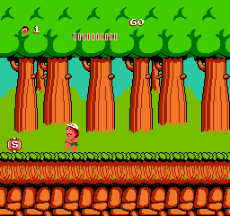
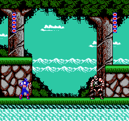
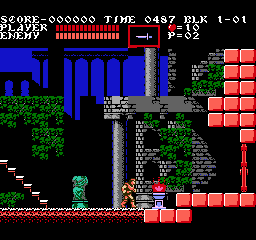
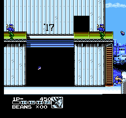
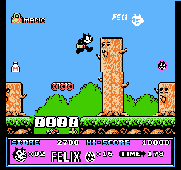
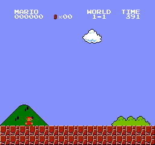
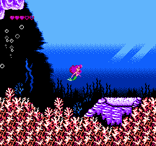
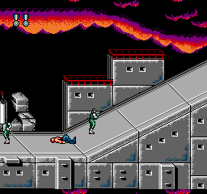
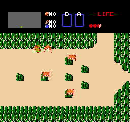
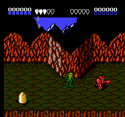

# NESRecomp

Статическая рекомпиляция NES-игр в нативный C-код. Нет горячего цикла интерпретатора — каждая инструкция 6502 становится C-функцией, которая возвращает управление в основной цикл после каждой инструкции изменения потока управления (JMP, JSR, RTS, RTI, BRK, ветвления). Интерпретатор используется только как запасной вариант для адресов, которые невозможно обнаружить статически (например, цели косвенного JMP).

## Как это работает

1. **Discoverer** (`tools/nesrecomp.py`) — обход в ширину (BFS) от векторов RESET/NMI/IRQ, следует по JSR/JMP abs/ветвлениям, группирует последовательные инструкции в функции, генерирует C-код
2. **Эмиттер** — каждая функция становится `void func_XXXX(void)`, которая устанавливает `cpu.PC`, добавляет `g_cpu_cycles`, выполняет инструкцию и делает `return` при любой инструкции изменения потока управления
3. **Таблица диспетчеризации** — `call_by_address(addr)` — switch по всем обнаруженным точкам входа функций; ветвь default выполняет одну инструкцию через интерпретатор
4. **Основной цикл** (`runner.c`) — диспетчеризует одну инструкцию за итерацию, затем делает шаг PPU (×3) и APU для накопленных циклов перед следующей диспетчеризацией
5. **Данные ROM** встраиваются в бинарник при компиляции через `tools/extract_rom_data.py` (ROM → C-заголовок/исходник) — ROM-файл не нужен во время выполнения

## Возможности

- **Без горячего цикла интерпретатора** — каждая инструкция возвращает управление в основной цикл; PPU/APU остаются синхронизированы
- **Без зависимости от ROM во время выполнения** — данные PRG/CHR скомпилированы в бинарник
- **Управление потоком на основе yield** — JMP, JSR, RTS, RTI, BRK и все ветвления устанавливают `cpu.PC` и делают `return`
- **Режим обучения** — `RECOMP_LEARN=1` собирает промахи диспетчеризации в `.cfg`-файл для следующей рекомпиляции
- **Универсальный Makefile** — один Makefile работает на Linux и Windows (MinGW), с поддержкой кросс-компиляции
- **Бинарник для каждой игры** — `GAME=BattleCity` → `bin/BattleCity`
- **Поддержка маперов** — NROM, MMC1, UNROM, CNROM, MMC3, MMC5
- **Состояния сохранения** — F5 сохранить, F8 загрузить (файл `<bin-dir>/sav/GAME.state`)
- **SRAM на батарейке** — автозагрузка/сохранение в `<bin-dir>/sav/GAME_battery.sav` при наличии battery-флага в картридже
- **Скриншот** — F12 (сохраняет `screenshot_<ticks>.png`); `--screenshot FILE.png` при запуске для PNG-захвата в headless-режиме
- **Полноэкранный режим** — переключение F11
- **Широкоэкранный режим** — переключение Tab
- **Масштаб** — `--scale N` при запуске; компиляционное значение по умолчанию через `make DEFAULT_SCALE=3`

## Быстрый старт

### Linux

```bash
# Установить зависимости
sudo apt install build-essential libsdl2-dev python3 make git

# Клонировать и собрать
git clone <url> nesrecomp
cd nesrecomp

# Положить ROM в rom/MyGame.nes, затем:
make GAME=MyGame
./bin/MyGame
```

`ROM` по умолчанию равен `rom/$(GAME).nes`. Если ROM находится в другом месте, передайте его явно:

```bash
make GAME=MyGame ROM=/path/to/game.nes
```

Если существует файл `asm/MyGame.asm` — он подхватывается автоматически. Конфиг `cfg/MyGame.cfg` всегда используется, если присутствует.

Файл `.asm` — это **исходник ca65** (например, из сессии ручного дизассемблирования в Ghidra, IDA или da65). `tools/nesrecomp.py` извлекает все адреса с метками ≥ `$8000` и добавляет их как дополнительные точки входа для BFS — полезно для кода, недостижимого при статическом анализе: целей косвенных переходов и таблиц диспетчеризации на основе данных.

Можно передать явно:

```bash
make GAME=MyGame ASM=MyGame.asm
```

При передаче `ASM` пайплайн запускает `asm_parser.py` отдельным шагом перед `nesrecomp.py`. Найденные метки добавляются как `extra_func` непосредственно в `cfg/MyGame.cfg` (существующие записи и другие директивы сохраняются).

### Windows (MinGW)

```bash
# Установить MSYS2 с mingw-w64-x86_64-gcc, SDL2, make, python
pacman -S mingw-w64-x86_64-gcc mingw-w64-x86_64-SDL2 make python

make GAME=MyGame
./bin/MyGame.exe
```

### Кросс-компиляция с Linux на Windows

```bash
sudo apt install gcc-mingw-w64-i686
make CROSS=1 GAME=MyGame
# создаёт bin/MyGame.exe (Windows PE)
```

## Режим обучения

Статический discoverer не может следовать косвенным переходам (`JMP ($XXXX)`). Чтобы найти недостающие адреса:

```bash
RECOMP_LEARN=1 GAME=MyGame ./bin/MyGame
# Играть в игру, затем выйти по ESC.
# Промахи диспетчеризации автоматически сохраняются в cfg/MyGame.cfg
```

Затем перекомпилировать — конфиг подхватывается автоматически:

```bash
make GAME=MyGame
```

Запускать повторно — каждая сессия дополняет предыдущий `cfg/MyGame.cfg`. В итоге весь достижимый код попадёт в таблицу диспетчеризации.

### Режим без интерфейса (Headless)

Запуск без видео и звука. Игра эмулируется на полной скорости, собирая промахи диспетчеризации:

```bash
RECOMP_LEARN=1 GAME=MyGame ./bin/MyGame --headless --seconds 30
```

`RECOMP_LEARN=1` устанавливается автоматически в headless-режиме.

### Воспроизведение TAS

Воспроизвести FM2-файл (запись FCEUX) для обхода кодовых путей полного прохождения:

```bash
RECOMP_LEARN=1 GAME=MyGame ./bin/MyGame --playback fm2/MyGame.fm2
```

Совместить с `--headless` для полностью автоматического обнаружения:

```bash
GAME=MyGame ./bin/MyGame --headless --playback fm2/MyGame.fm2
```

На каждом кадре (`NMI`) состояние контроллера загружается из следующей строки FM2. Клавиатура игнорируется во время воспроизведения. Программа завершается, когда все кадры исчерпаны.

## Управление

### Геймпад (Игрок 1)

| Кнопка NES | Клавиша        |
|------------|----------------|
| A          | Z              |
| B          | X              |
| Select     | Right Shift    |
| Start      | Enter          |
| Вверх      | Стрелка вверх  |
| Вниз       | Стрелка вниз   |
| Влево      | Стрелка влево  |
| Вправо     | Стрелка вправо |

### Горячие клавиши

| Клавиша | Действие                                        |
|---------|-------------------------------------------------|
| ESC     | Выход                                           |
| F5      | Сохранить состояние (`sav/GAME.state`)          |
| F8      | Загрузить состояние                             |
| F11     | Полноэкранный режим                             |
| F12     | Скриншот (`screenshot_<ticks>.png`)             |
| Tab     | Широкоэкранный режим (pillarbox → растяжение)   |

## Структура проекта

```
src/
  runner.c / include/runner.h   — SDL-цикл, ввод, звук, состояния сохранения
  cpu_interp.c                  — интерпретатор 6502 (запасной вариант)
  fm2_player.c / include/fm2_player.h — воспроизведение FM2 TAS (файл или директория)
  ppu.c / include/ppu.h         — эмуляция PPU 2C02
  apu.c / include/apu.h         — эмуляция APU (прямоугольные, треугольный, шум, DMC)
  mapper.c / include/mapper.h   — логика маперов (NROM, MMC1, UNROM, CNROM, MMC3, MMC5)
  memory.c                      — карта адресов CPU, ввод-вывод контроллеров
  include/                      — общие заголовки (cpu, ppu, apu, mapper, interrupts)

tools/
  nesrecomp.py          — статический рекомпилятор / discoverer / эмиттер C
  asm_parser.py         — парсер меток ca65 (посев BFS из ручного дизассемблирования)
  extract_rom_data.py   — ROM → встроенный C-заголовок/исходник

generated/            — рекомпилированные C-файлы и встроенные данные ROM (авто-генерация)

rom/                  — NES ROM-файлы (.nes) — не отслеживаются git
cfg/                  — конфиг дополнительных точек входа для каждой игры (вывод режима обучения)
asm/                  — исходники ca65 для посева BFS по меткам — не отслеживаются git
fm2/                  — TAS-файлы FCEUX для автоматизированного обнаружения — не отслеживаются git
docs/                 — справочная документация — не отслеживается git
```

## Поддерживаемые маперы

| ID | Название | Примечания                                                                              |
|----|----------|-----------------------------------------------------------------------------------------|
| 0  | NROM     | Фиксированный PRG 16/32 КБ; полностью рекомпилируем                                    |
| 1  | MMC1     | 16 КБ switchable + фиксированный последний; CHR-RAM; переключаемый банк через интерпретатор |
| 2  | UNROM    | 16 КБ switchable + фиксированный последний; CHR фикс.; переключаемый банк через интерпретатор |
| 3  | CNROM    | Фиксированный PRG; переключаемый CHR 8 КБ                                              |
| 4  | MMC3     | Гранулярность PRG/CHR 8 КБ; scanline IRQ; переключаемые банки через интерпретатор      |
| 5  | MMC5     | PRG mode 2, CHR 8×16, ExRAM; переключаемые банки через интерпретатор                   |
| 7  | AxROM    | PRG 32 КБ switchable; CHR-RAM; one-screen mirroring; переключаемый банк через интерпретатор |

### Протестированные игры

| Игра                  | Маппер | Запуск | Заставка | Геймплей | Примечания                                      |
|-----------------------|--------|--------|----------|----------|-------------------------------------------------|
| Battle City           | 0      | ✅     | ✅       | ✅       | Базовая проверка NROM-128                       |
| Super Mario Bros.     | 0      | ✅     | ✅       | ✅       | Базовая проверка NROM-256                       |
| The Legend of Zelda   | 1      | ✅     | ✅       | ✅       | MMC1, CHR-RAM, SRAM на батарейке                |
| The Little Mermaid    | 2      | ✅     | ✅       | ✅       | UNROM, 128 КБ PRG, CHR-RAM                      |
| Adventure Island      | 3      | ✅     | ✅       | ✅       | CNROM, переключаемый CHR 32 КБ                  |
| Felix the Cat         | 4      | ✅     | ✅       | ✅       | MMC3 scanline IRQ                               |
| Castlevania III       | 5      | ✅     | ✅       | ✅       | MMC5 PRG mode 2; переключаемые банки через интерпретатор |
| Battletoads           | 7      | ✅     | ✅       | ✅       | AxROM, 128 КБ PRG, CHR-RAM; все банки через интерпретатор |

## Скриншоты

| | | |
|---|---|---|
|  |  |  |
| Adventure Island | Battle City | Captain America and the Avengers |
|  |  |  |
| Castlevania III | Contra Force | Felix the Cat |
|  |  |  |
| Super Mario Bros. | The Little Mermaid | Super C |
|  |  | |
| The Legend of Zelda | Battletoads | |

## Лицензия

MIT
